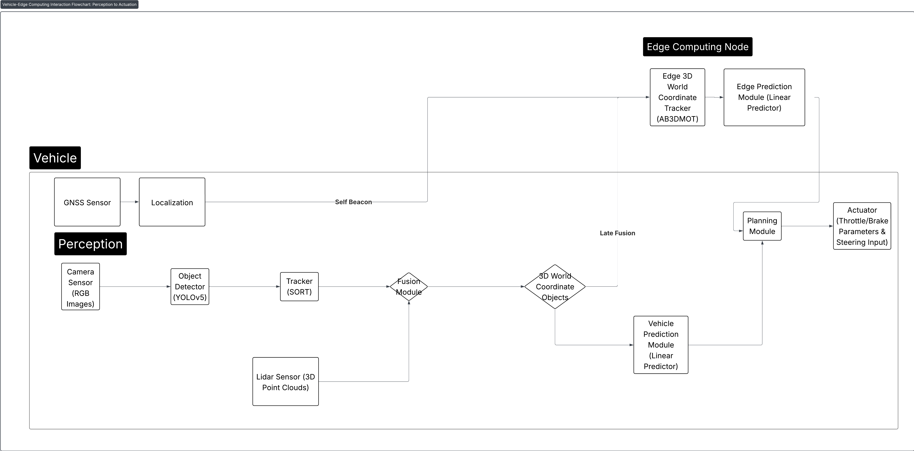

# eCAV: Distributed Simulation for Edge-Assisted Autonomy

eCAV is a distributed simulation platform for characterizing the operational safety envelope of edge-assisted autonomous vehicles. Derived from OpenCDA, the platform explicitly models network latency, jitter, and multi-source state inconsistency to evaluate their impact on closed-loop safety.

## Research Features

- Self-Beacon Anchoring (SBA): A protocol enforcing an ego-uniqueness invariant at the edge publish boundary to eliminate self-ghosting failures.
- Distributed gRPC Architecture: Decouples the orchestrator, edge servers, and vehicle clients to support asynchronous execution.
- Latency-Aware Tracking: Support for multiple edge architectures, including late fusion with AB3DMOT, VIPS (velocity-based temporal alignment), and oracle ground-truth baselines.
- Collaborative Perception: Integration for intermediate feature fusion (BM2CP) and world-model reconciliation (WorldFusion).
- Network Modeling: Trace-driven models for radio (C-V2X PC5) and backhaul latency using SEE-V2X and 5G-MOBIX datasets.
- MAC-Layer Modeling: Implementation of C-V2X PC5 Mode 4 Sensing-Based Semi-Persistent Scheduling (3GPP TS 36.321).
- Scenario Library: Evaluation in high-risk occlusion scenarios derived from NHTSA Pre-Crash Typologies.

## System Architecture



The platform consists of three primary components:
1. Vehicles: Run local perception (YOLOv5/SORT) and planning logic in Docker containers.
2. Edge Server: Performs multi-vehicle tracking, temporal reconciliation, and SBA-enforced state publishing.
3. Orchestrator: Manages simulation clock synchronization and global ground-truth state.

The distributed design allows for horizontal scaling by load-balancing vehicle traffic across multiple edge server instances. It supports heterogeneous stacks where different vehicles execute distinct algorithms asynchronously.

## Installation

### Requirements
- Ubuntu 20.04/22.04
- CARLA Simulator 0.9.12+
- NVIDIA GPU (RTX 3080+ recommended)
- Docker and NVIDIA Container Toolkit

### Setup
Manage dependencies using Conda:

```bash
conda env create -f environment.yml
conda activate ecav
pip install -r requirements_3_10.txt
```

Generate gRPC stubs:
```bash
python -m grpc_tools.protoc -I./ecav/protos --python_out=. --grpc_python_out=. ./ecav/protos/ecloud.proto
```

## Usage

### Sequential Mode
Run all components in a single process for algorithm debugging:
```bash
python ecav.py -t openscenario_3_edge_late_fusion --apply_ml
```

### Distributed Mode
1. Start the Orchestrator:
   ```bash
   python ecav.py -t openscenario_3_edge_late_fusion -d
   ```
2. Start Vehicle Clients:
   ```bash
   python ecav.py -d -i 0  # Focal vehicle
   python ecav.py -d -i 1  # Additional vehicle
   ```

### Containerized Mode
```bash
sudo docker build -t vehicle-sim .
sudo bash start_vehicles.sh
```

## Experiments

The `test_runner.py` script automates parameter sweeps for latency, ego count, and protocol configurations.

Example multi-ego latency sweep:
```bash
python test_runner.py -t openscenario_3_edge_late_fusion \
  --manager-types late_fusion \
  --latencies 0 100 200 400 \
  --ego-counts 1 4 8 16 \
  --anchoring both \
  --repetitions 3
```

## Attributions

eCAV integrates research from the following projects:
- [OpenCDA](https://github.com/ucla-mobility/OpenCDA): Baseline coordination and planning logic.
- [OpenCOOD](https://github.com/ucla-mobility/OpenCOOD): Collaborative perception (BM2CP).
- [AB3DMOT](https://github.com/xinshuoweng/AB3DMOT): 3D multi-object tracking.
- [SMART](https://github.com/rainmaker22/SMART): Trajectory prediction.
- [Waymo Open Dataset](https://waymo.com/open/): Perception model training.
- [CARLA](https://github.com/carla-simulator/carla): Physics and sensor simulation.

## Citation

```bibtex
@misc{landle2025ecav,
      title={eCAV: An Edge-Assisted Evaluation Platform for Connected Autonomous Vehicles}, 
      author={Tyler Landle and others},
      year={2025},
      eprint={2506.16535},
      archivePrefix={arXiv},
      primaryClass={cs.RO},
      url={https://arxiv.org/abs/2506.16535}, 
}
```

arXiv: <https://arxiv.org/abs/2506.16535>

```bibtex
@misc{xu2021opencdaanopencooperativedriving,
      title={OpenCDA: An Open Cooperative Driving Automation Framework Integrated with Co-Simulation}, 
      author={Runsheng Xu and Yi Guo and Xu Han and Xin Xia and Hao Xiang and Jiaqi Ma},
      year={2021},
      eprint={2107.06260},
      archivePrefix={arXiv},
      primaryClass={cs.RO},
      url={https://arxiv.org/abs/2107.06260}, 
}

@inproceedings{xu2022opencood,
  author    = {Runsheng Xu and Hao Xiang and Xin Xia and Xu Han and Jinlong Li and Jiaqi Ma},
  title     = {OPV2V: An Open Benchmark Dataset and Fusion Pipeline for Perception with Vehicle-to-Vehicle Communication},
  booktitle = {2022 IEEE International Conference on Robotics and Automation (ICRA)},
  year      = {2022}
}

@inproceedings{Weng2020_AB3DMOT,
  author    = {Xinshuo Weng and Jianren Wang and David Held and Kris Kitani},
  title     = {AB3DMOT: A Baseline for 3D Multi-Object Tracking and New Evaluation Metrics},
  booktitle = {Proceedings of the IEEE/CVF Conference on Computer Vision and Pattern Recognition (CVPR) Workshops},
  year      = {2020}
}

@inproceedings{xie2024smart,
  title={SMART: Scalable Multi-agent Real-time Motion Generation via Next-token Prediction},
  author={Xie, Kerui and Huang, Zhiyu and Zhou, Zewei and Ma, Jiaqi},
  booktitle={Advances in Neural Information Processing Systems (NeurIPS)},
  volume={37},
  year={2024}
}

@InProceedings{Sun_2020_CVPR,
  author    = {Sun, Pei and Kretzschmar, Henrik and Dotiwalla, Xerxes and Chouard, Aurelien and Patnaik, Vijaysai and Tsui, Paul and Guo, James and Zhou, Yin and Chai, Yuning and Caine, Benjamin and Vasudevan, Vijay and Han, Wei and Ngiam, Jiquan and Zhao, Hang and Timofeev, Aleksei and Ettinger, Scott and Krivokon, Maxim and Gao, Amy and Joshi, Aditya and Sheng, Zhao and Cheng, Shuyang and Zhang, Yu and Shlens, Jonathon and Chen, Zhifeng and Anguelov, Dragomir},
  title     = {Scalability in Perception for Autonomous Driving: Waymo Open Dataset},
  booktitle = {Proceedings of the IEEE/CVF Conference on Computer Vision and Pattern Recognition (CVPR)},
  month     = {June},
  year      = {2020},
  pages     = {2446-2454}
}

@InProceedings{pmlr-v78-dosovitskiy17a,
  title     = {{CARLA}: {An} Open Urban Driving Simulator},
  author    = {Dosovitskiy, Alexey and Ros, German and Codevilla, Felipe and Lopez, Antonio and Koltun, Vladlen},
  booktitle = {Proceedings of the 1st Annual Conference on Robot Learning},
  pages     = {1--16},
  year      = {2017},
  editor    = {Levine, Sergey and Vanhoucke, Vincent and Goldberg, Ken},
  volume    = {78},
  series    = {Proceedings of Machine Learning Research},
  publisher = {PMLR}
}
```
