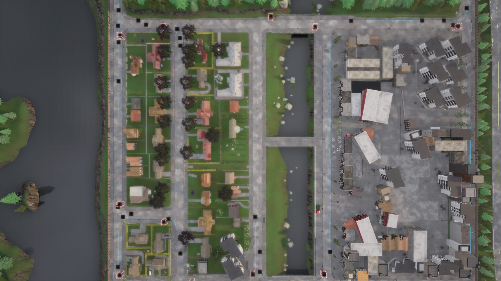

# Town01__2023_11_10_22_23_28

## Map
- **CARLA Town**: Town01
- **Dataset directory**: Town01__2023_11_10_22_23_28

## Agents
- **CAVs**: 50
- **RSUs**: 12
- **Total agents**: 62

## Duration
- **Max frames per agent**: 300
- **Duration**: 30.0 seconds (at 10 Hz)
- **Total agent-frames**: 17711

## Object Categories Observed
- car: 17486 observations (sampled)
- cycle: 1537 observations (sampled)
- motorcycle: 3243 observations (sampled)
- pedestrian: 25833 observations (sampled)
- truck: 1040 observations (sampled)
- van: 1322 observations (sampled)

## Objects Per Frame
- **Mean**: 28.5
- **Max**: 61
- **Std**: 11.8

## Connection Statistics
- **Mean connections per agent-frame**: 9.52
- **Median**: 10
- **Max**: 18

### Connection Count Distribution (sampled)
  - 1 connections: 10 samples
  - 2 connections: 34 samples
  - 3 connections: 100 samples
  - 4 connections: 158 samples
  - 5 connections: 114 samples
  - 6 connections: 126 samples
  - 7 connections: 107 samples
  - 8 connections: 107 samples
  - 9 connections: 81 samples
  - 10 connections: 148 samples
  - 11 connections: 63 samples
  - 12 connections: 215 samples
  - 13 connections: 134 samples
  - 14 connections: 105 samples
  - 15 connections: 156 samples
  - 16 connections: 70 samples
  - 17 connections: 32 samples
  - 18 connections: 13 samples

## Speed Statistics
- **Mean speed**: 8.2 km/h (2.3 m/s)
- **Max speed**: 69.3 km/h (19.2 m/s)
- **Std**: 15.6 km/h

## Spatial Coverage
- **Bounding box**: x=[62.1, 396.4], y=[0.0, 330.6]
- **Extent**: 334.3 m x 330.6 m

## Scenario Description
Town01 is a small town with T-junctions and a mix of two-lane roads. The layout includes residential-style streets with moderate curvature and a few signalized intersections. Vegetation lines both sides of the road.

## Screenshot

