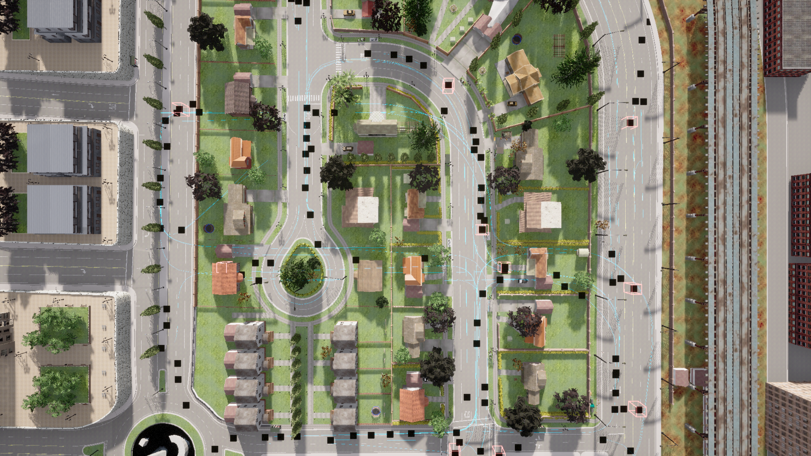

# Town03__2023_11_13_18_26_24

## Map
- **CARLA Town**: Town03
- **Dataset directory**: Town03__2023_11_13_18_26_24

## Agents
- **CAVs**: 100
- **RSUs**: 11
- **Total agents**: 111

## Duration
- **Max frames per agent**: 300
- **Duration**: 30.0 seconds (at 10 Hz)
- **Total agent-frames**: 33300

## Object Categories Observed
- car: 43001 observations (sampled)
- cycle: 5069 observations (sampled)
- motorcycle: 9153 observations (sampled)
- pedestrian: 38489 observations (sampled)
- truck: 2389 observations (sampled)
- van: 3798 observations (sampled)

## Objects Per Frame
- **Mean**: 30.6
- **Max**: 67
- **Std**: 13.6

## Connection Statistics
- **Mean connections per agent-frame**: 12.04
- **Median**: 12
- **Max**: 25

### Connection Count Distribution (sampled)
  - 1 connections: 25 samples
  - 2 connections: 23 samples
  - 3 connections: 30 samples
  - 4 connections: 46 samples
  - 5 connections: 89 samples
  - 6 connections: 126 samples
  - 7 connections: 176 samples
  - 8 connections: 164 samples
  - 9 connections: 271 samples
  - 10 connections: 262 samples
  - 11 connections: 234 samples
  - 12 connections: 269 samples
  - 13 connections: 250 samples
  - 14 connections: 301 samples
  - 15 connections: 329 samples
  - 16 connections: 294 samples
  - 17 connections: 184 samples
  - 18 connections: 139 samples
  - 19 connections: 44 samples
  - 20 connections: 40 samples
  - 21 connections: 8 samples
  - 22 connections: 3 samples
  - 23 connections: 8 samples
  - 24 connections: 13 samples
  - 25 connections: 2 samples

## Speed Statistics
- **Mean speed**: 9.5 km/h (2.6 m/s)
- **Max speed**: 76.5 km/h (21.3 m/s)
- **Std**: 15.0 km/h

## Spatial Coverage
- **Bounding box**: x=[0.0, 245.5], y=[0.0, 209.2]
- **Extent**: 245.5 m x 209.2 m

## Scenario Description
Town03 is a larger urban environment with a central roundabout, multi-lane roads, and several signalized intersections. The road network includes highway on-ramps and varied elevation changes.

## Screenshot

