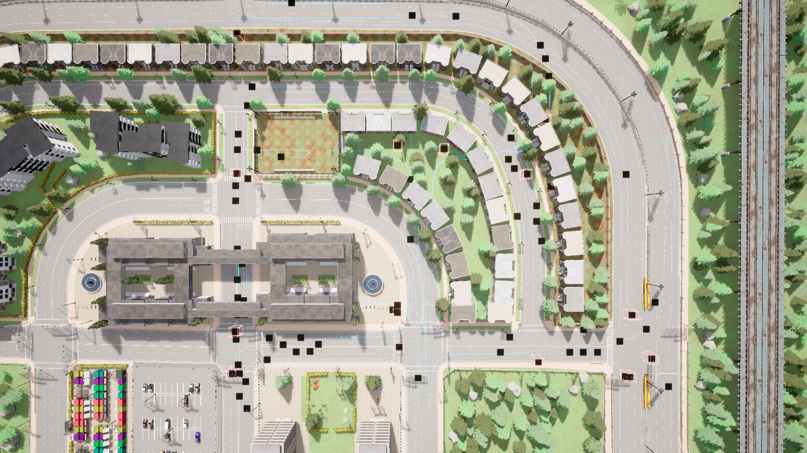

# Town05__2023_11_13_23_03_07

## Map
- **CARLA Town**: Town05
- **Dataset directory**: Town05__2023_11_13_23_03_07

## Agents
- **CAVs**: 80
- **RSUs**: 15
- **Total agents**: 95

## Duration
- **Max frames per agent**: 300
- **Duration**: 30.0 seconds (at 10 Hz)
- **Total agent-frames**: 28500

## Object Categories Observed
- car: 56817 observations (sampled)
- cycle: 5278 observations (sampled)
- motorcycle: 10643 observations (sampled)
- pedestrian: 40113 observations (sampled)
- truck: 4084 observations (sampled)
- van: 4469 observations (sampled)

## Objects Per Frame
- **Mean**: 42.6
- **Max**: 92
- **Std**: 21.4

## Connection Statistics
- **Mean connections per agent-frame**: 11.80
- **Median**: 11
- **Max**: 27

### Connection Count Distribution (sampled)
  - 1 connections: 28 samples
  - 2 connections: 69 samples
  - 3 connections: 46 samples
  - 4 connections: 83 samples
  - 5 connections: 105 samples
  - 6 connections: 146 samples
  - 7 connections: 167 samples
  - 8 connections: 238 samples
  - 9 connections: 242 samples
  - 10 connections: 193 samples
  - 11 connections: 111 samples
  - 12 connections: 111 samples
  - 13 connections: 147 samples
  - 14 connections: 200 samples
  - 15 connections: 176 samples
  - 16 connections: 214 samples
  - 17 connections: 148 samples
  - 18 connections: 97 samples
  - 19 connections: 107 samples
  - 20 connections: 91 samples
  - 21 connections: 35 samples
  - 22 connections: 37 samples
  - 23 connections: 21 samples
  - 24 connections: 23 samples
  - 25 connections: 6 samples
  - 26 connections: 4 samples
  - 27 connections: 5 samples

## Speed Statistics
- **Mean speed**: 11.7 km/h (3.2 m/s)
- **Max speed**: 76.6 km/h (21.3 m/s)
- **Std**: 17.8 km/h

## Spatial Coverage
- **Bounding box**: x=[0.1, 275.5], y=[0.0, 207.5]
- **Extent**: 275.5 m x 207.5 m

## Scenario Description
Town05 features a grid-like urban layout with multi-lane roads, numerous signalized four-way intersections, and highway sections with overpasses. The environment includes both urban core and suburban fringe areas.

## Screenshot

