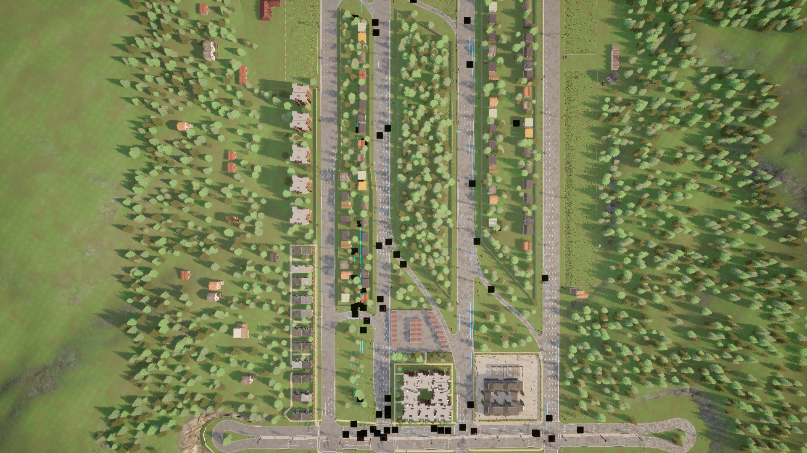

# Town06__2023_11_14_16_39_31

## Map
- **CARLA Town**: Town06
- **Dataset directory**: Town06__2023_11_14_16_39_31

## Agents
- **CAVs**: 70
- **RSUs**: 8
- **Total agents**: 78

## Duration
- **Max frames per agent**: 390
- **Duration**: 39.0 seconds (at 10 Hz)
- **Total agent-frames**: 30420

## Object Categories Observed
- car: 32201 observations (sampled)
- cycle: 3067 observations (sampled)
- motorcycle: 6308 observations (sampled)
- truck: 2440 observations (sampled)
- van: 2362 observations (sampled)

## Objects Per Frame
- **Mean**: 15.2
- **Max**: 35
- **Std**: 8.5

## Connection Statistics
- **Mean connections per agent-frame**: 7.03
- **Median**: 6
- **Max**: 20

### Connection Count Distribution (sampled)
  - 1 connections: 233 samples
  - 2 connections: 228 samples
  - 3 connections: 290 samples
  - 4 connections: 212 samples
  - 5 connections: 287 samples
  - 6 connections: 304 samples
  - 7 connections: 223 samples
  - 8 connections: 211 samples
  - 9 connections: 200 samples
  - 10 connections: 196 samples
  - 11 connections: 151 samples
  - 12 connections: 135 samples
  - 13 connections: 122 samples
  - 14 connections: 100 samples
  - 15 connections: 75 samples
  - 16 connections: 16 samples
  - 17 connections: 9 samples
  - 18 connections: 31 samples
  - 19 connections: 16 samples
  - 20 connections: 3 samples

## Speed Statistics
- **Mean speed**: 23.1 km/h (6.4 m/s)
- **Max speed**: 72.1 km/h (20.0 m/s)
- **Std**: 20.6 km/h

## Spatial Coverage
- **Bounding box**: x=[0.1, 676.5], y=[0.0, 412.7]
- **Extent**: 676.5 m x 412.7 m

## Scenario Description
Town06 is characterized by long highway segments with entrance and exit ramps, connected to a small urban area with four-way intersections. The highway portion features multi-lane divided roads.

## Screenshot

