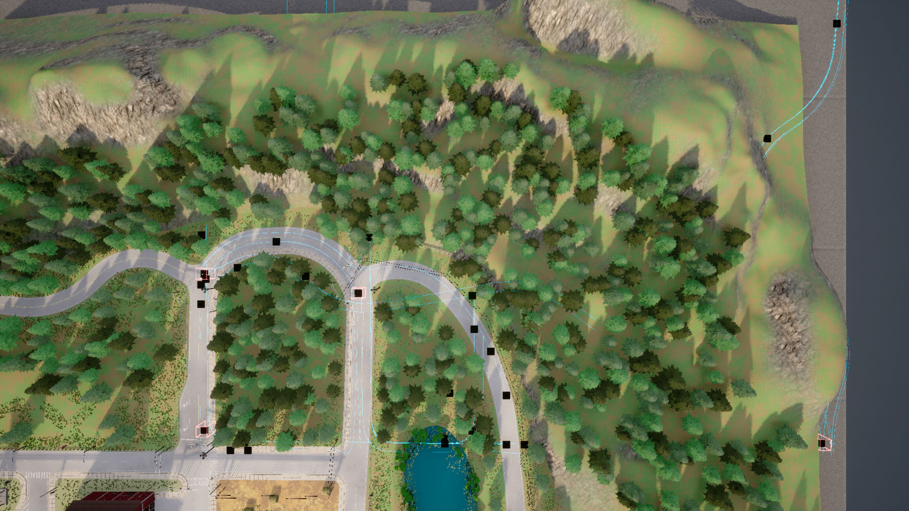

# Town07__2023_11_14_22_06_38

## Map
- **CARLA Town**: Town07
- **Dataset directory**: Town07__2023_11_14_22_06_38

## Agents
- **CAVs**: 60
- **RSUs**: 5
- **Total agents**: 65

## Duration
- **Max frames per agent**: 301
- **Duration**: 30.1 seconds (at 10 Hz)
- **Total agent-frames**: 19565

## Object Categories Observed
- car: 22301 observations (sampled)
- cycle: 2369 observations (sampled)
- motorcycle: 3550 observations (sampled)
- pedestrian: 7856 observations (sampled)
- truck: 964 observations (sampled)
- van: 1243 observations (sampled)

## Objects Per Frame
- **Mean**: 19.0
- **Max**: 47
- **Std**: 13.3

## Connection Statistics
- **Mean connections per agent-frame**: 9.68
- **Median**: 9
- **Max**: 22

### Connection Count Distribution (sampled)
  - 1 connections: 13 samples
  - 2 connections: 27 samples
  - 3 connections: 35 samples
  - 4 connections: 81 samples
  - 5 connections: 176 samples
  - 6 connections: 150 samples
  - 7 connections: 243 samples
  - 8 connections: 159 samples
  - 9 connections: 184 samples
  - 10 connections: 177 samples
  - 11 connections: 145 samples
  - 12 connections: 150 samples
  - 13 connections: 104 samples
  - 14 connections: 93 samples
  - 15 connections: 65 samples
  - 16 connections: 70 samples
  - 17 connections: 40 samples
  - 18 connections: 32 samples
  - 19 connections: 27 samples
  - 20 connections: 23 samples
  - 21 connections: 9 samples
  - 22 connections: 12 samples

## Speed Statistics
- **Mean speed**: 17.8 km/h (4.9 m/s)
- **Max speed**: 63.7 km/h (17.7 m/s)
- **Std**: 18.0 km/h

## Spatial Coverage
- **Bounding box**: x=[0.0, 204.6], y=[0.0, 249.0]
- **Extent**: 204.6 m x 249.0 m

## Scenario Description
Town07 is a rural setting with narrow two-lane roads, sharp curves, and minimal signalized intersections. The road network winds through countryside terrain with limited infrastructure.

## Screenshot

