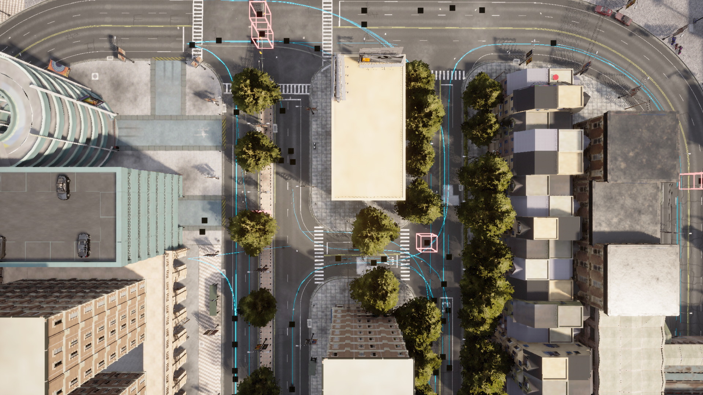

# Town10HD__2023_11_15_00_20_38

## Map
- **CARLA Town**: Town10HD
- **Dataset directory**: Town10HD__2023_11_15_00_20_38

## Agents
- **CAVs**: 50
- **RSUs**: 5
- **Total agents**: 55

## Duration
- **Max frames per agent**: 300
- **Duration**: 30.0 seconds (at 10 Hz)
- **Total agent-frames**: 16500

## Object Categories Observed
- car: 31167 observations (sampled)
- cycle: 3578 observations (sampled)
- motorcycle: 5453 observations (sampled)
- pedestrian: 21376 observations (sampled)
- truck: 1632 observations (sampled)
- van: 1860 observations (sampled)

## Objects Per Frame
- **Mean**: 39.4
- **Max**: 70
- **Std**: 20.5

## Connection Statistics
- **Mean connections per agent-frame**: 17.11
- **Median**: 17
- **Max**: 31

### Connection Count Distribution (sampled)
  - 2 connections: 10 samples
  - 3 connections: 28 samples
  - 4 connections: 4 samples
  - 5 connections: 21 samples
  - 6 connections: 26 samples
  - 7 connections: 57 samples
  - 8 connections: 28 samples
  - 9 connections: 37 samples
  - 10 connections: 69 samples
  - 11 connections: 97 samples
  - 12 connections: 68 samples
  - 13 connections: 71 samples
  - 14 connections: 123 samples
  - 15 connections: 65 samples
  - 16 connections: 95 samples
  - 17 connections: 110 samples
  - 18 connections: 85 samples
  - 19 connections: 49 samples
  - 20 connections: 42 samples
  - 21 connections: 78 samples
  - 22 connections: 73 samples
  - 23 connections: 46 samples
  - 24 connections: 48 samples
  - 25 connections: 91 samples
  - 26 connections: 73 samples
  - 27 connections: 54 samples
  - 28 connections: 48 samples
  - 29 connections: 40 samples
  - 30 connections: 10 samples
  - 31 connections: 4 samples

## Speed Statistics
- **Mean speed**: 5.7 km/h (1.6 m/s)
- **Max speed**: 52.5 km/h (14.6 m/s)
- **Std**: 10.7 km/h

## Spatial Coverage
- **Bounding box**: x=[0.0, 112.9], y=[0.0, 133.9]
- **Extent**: 112.9 m x 133.8 m

## Scenario Description
Town10HD is a dense downtown environment with narrow one-way streets, numerous four-way intersections in a grid pattern, and pedestrian-heavy zones. Buildings line both sides of the streets, creating urban canyon effects.

## Screenshot

